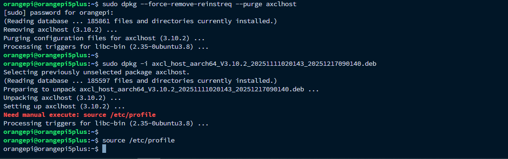
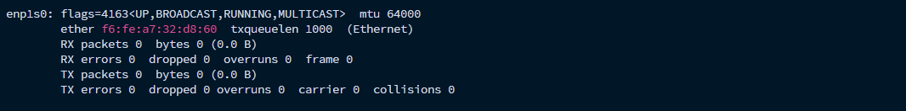
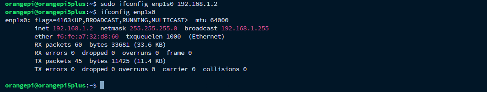
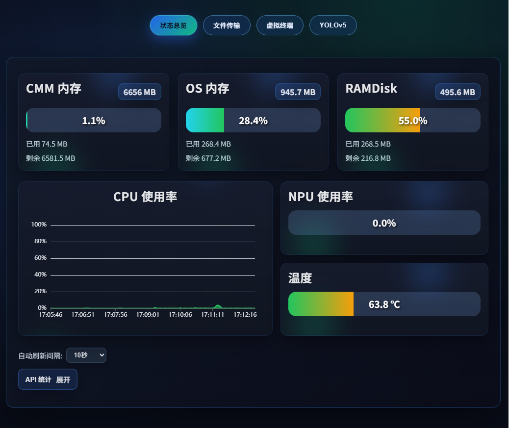
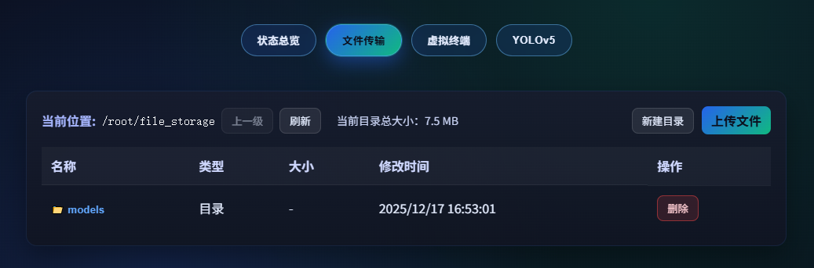
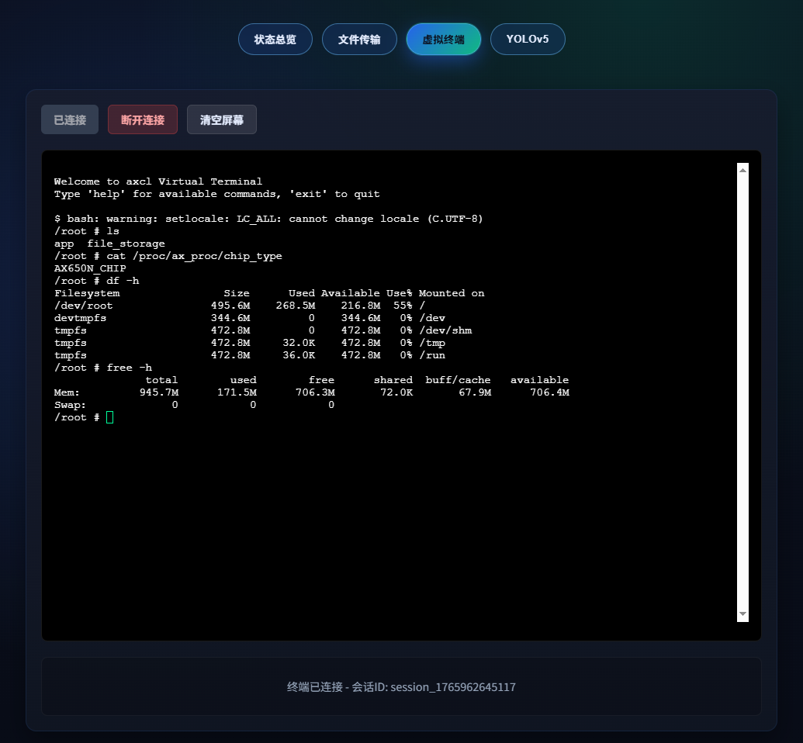
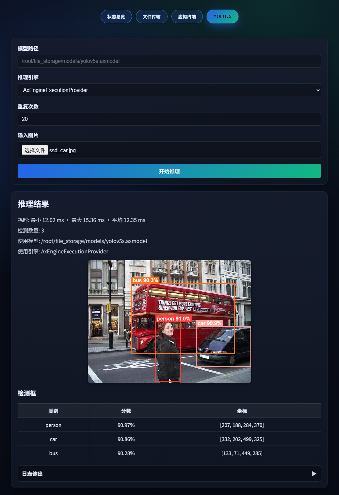

# Example：OrangePi5Plus (RK3588)
以 OrangePi5Plus (RK3588) 开发板为例，介绍如何使用axcl_forge的驱动。

## 一 准备工作

- Orange Pi 5 Plus 开发板（搭载 RK3588 芯片）
- Axera 算力卡

## 二 安装算力卡驱动

如果之前安装过旧版驱动，先卸载掉，然后安装新版本。


```bash
sudo dpkg --force-remove-reinstreq --purge axclhost
sudo dpkg -i axcl_host_aarch64_V3.10.2_20251111020143_20251218024300.deb
```



## 三 加载 PCIe 虚拟网卡并配置 IP

加载算力卡的 PCIe 虚拟网卡驱动，安装完驱动后ifconfig看一下会多出来一个网卡设备，对它设置IP地址。

```bash
sudo insmod /lib/modules/$(uname -r)/extra/ax_pcie_net_host.ko
```


```bash
sudo ifconfig
```
新加的网卡名应为ax-net0，但如果有系统设置了udev规则，则会被重命名为规则指定的名字。本例中为`enp1s0`


```bash
sudo ifconfig enp1s0 192.168.1.2
```


## 四 访问算力卡的 Web 管理界面

在开发板上打开浏览器，访问算力卡内置的 Web 站点，http://192.168.1.1:8080，开始使用各项功能。

### 功能介绍

#### 状态总览



#### 文件传输



#### 虚拟终端



#### YOLOv5s


